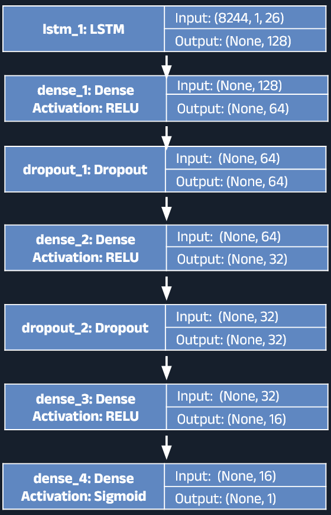
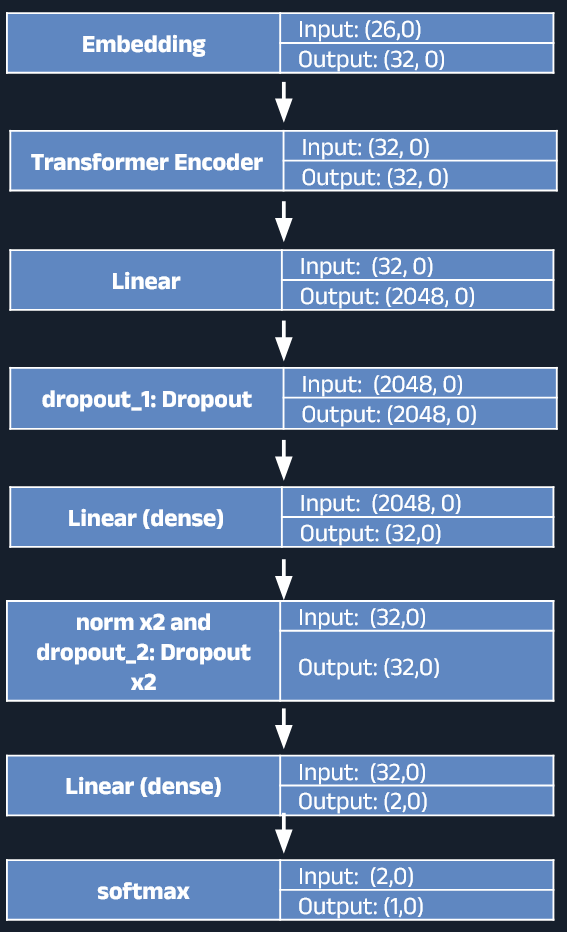
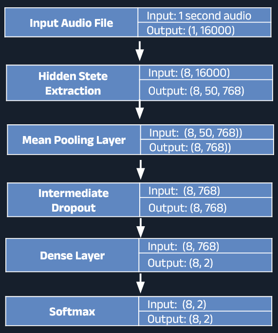
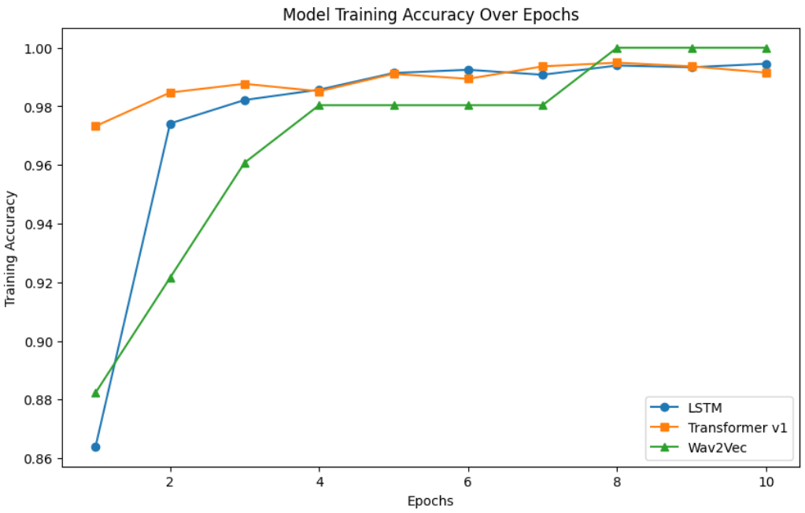

# Deep Learning for Deepfake Audio Detection

This project aims to detect Deepfake generated audio by creating three different deep learning models to classify between real and fake audio. The goal is to prevent decietful or malicious AI content by correcting flagging the content as AI generated. 

<br>


## Dataset

The data used comes from DEEP-VOICE: DeepFake Voice Recognition dataset. The dataset is composed of 56 ai audio files, 8 real audio files, and a csv document containing 11779 x 26 features extracted using librosa. Using librosa and the audio files, a new dataset consisting of 10 consecutive seconds datapoints were generated for better recurrent neural network analysis

More information can be found at: [Kaggle Dataset](https://www.kaggle.com/datasets/birdy654/deep-voice-deepfake-voice-recognition/)


## LSTM Model

The LSTM model consist of 6 layers
<br>


## Transformer Model
The Transformer model 
<br>


## Wav2Vec2 Model

<br>



## Installation

The code requires `python>=3.8`. Required dependencies are found in `requirements.txt`.

Clone the repository locally using

```
git clone https://github.com/kaifanyu/DeepFake-Audio-Detection.git
```

Create a virtual environment for dependencies (optional) then install dependencies using

```
pip install -r requirements.txt
```

## Getting Started

<!-- Model checkpoints can be downloaded at: [https://drive.google.com/drive/folders/1JmsNXJ9Hsimfr2JaOQ9sa2yyxFtptSyK?usp=sharing](https://drive.google.com/drive/folders/sfsdfsdfsdfsdf) -->

The following model checkpoints are available:

- LSTM
- Transformer
- Wav2Vec2

<!-- 
## ML Pipeline

 -->

## Performance

The following shows various aspects for each model.

<div align=center>

</div>

<br>

Comparison of LSTM, Transformer v1, and Wav2Vec2 custom model.

Although different datapoints were used between the Wav2Vec2 model as it was extracted using Wav2Vec2 pretrained model, most of the models actually performed relatively the same when scored, with some models just slightly outperforming the others. The Wav2Vec2 gave the best overall accuracy


## Acknowledgements

This project makes use of the base Unet3+ implementation described in the following paper:

[wav2vec 2.0: A Framework for Self-Supervised Learning of Speech Representations](https://arxiv.org/pdf/2006.11477)
